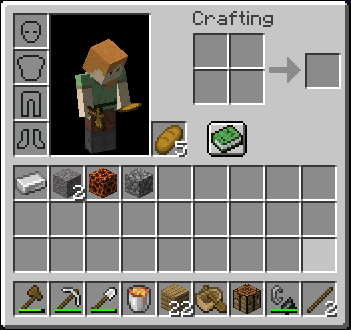
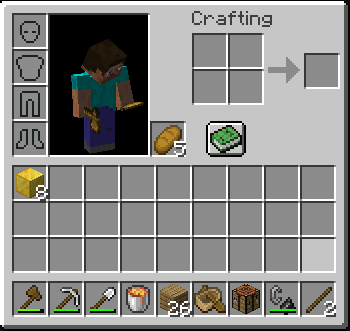
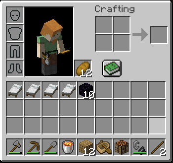
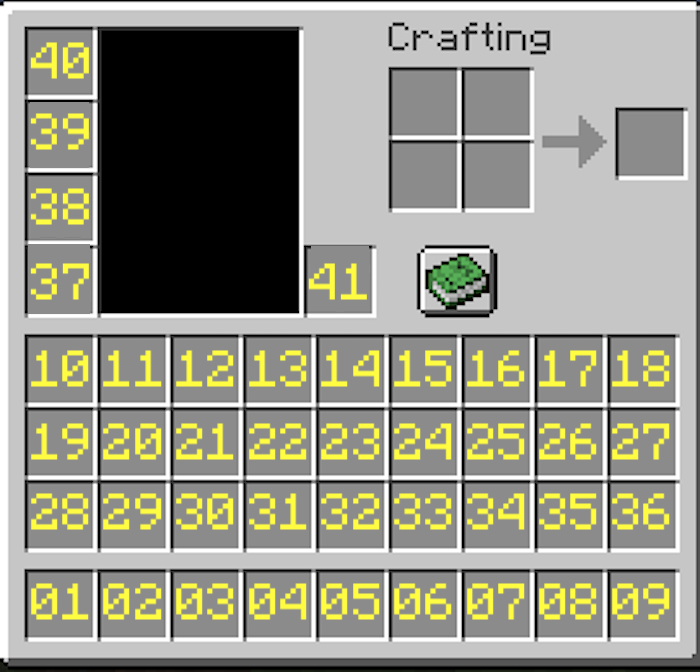

# Noverworld

## About

When you create a new world, you will spawn in the nether at a portal.
Your inventory contains a set of standard nether entry items you would have in a usual hypermodern RSG situation where
you intend to do bastion trades. Beat the dragon and reach the credits as usual.



_The bundled inventory for the `Bastion`/default category_



_The bundled inventory for the `Monument` category_



_The bundled inventory for the `Classic` category_

You cannot customise the number, type or durability of the items in your inventory but you can adjust what slot they're in.
You do this through editing `config/noverworld-X.X.X.json`.

_(At the moment the slot of unstackable non-unique items, eg. the beds in classic, are not changeable. This may change
in the future.)_

```json
{
  "f3Enabled": true,
  "recipeBookEnabled": true,
  "inventory": [
    {
      "name": "WOODEN_AXE",
      "slot": 1
    },
    ...
    {
      "name": "BREAD",
      "slot": 41
    }
  ]
}
```



_The slots to inventory mapping. ie. if you want to put something in the hotbar, use slot 41._

Every new release of noverworld will create a new config file, so if you want to use your slot config from the previous
version copy it over. This is to allow players to easily use different releases of the mod (eg. Bastion to Monument)
at the same time without having to delete their config file every time.

Before you join a new world the mod saves your render distance and FOV, and resets to this after you leave the world.
_ie. this means you can configure the RD and FOV you will always spawn with by changing it in the main menu, and you
don't have to reset these settings to your preferred defaults in between runs._

Depending on the version you are using the f3 menu will be automatically opened for you.

When you spawn your yaw (facing angle) is randomised. The y height of the portal the mod attempts to target is also
randomly determined using a different distribution per release. You can see this distribution in
[`fixed_config.json`](src/main/resources/fixed_config.json) _(Make sure to switch to the right branch)_

All random values in the mod are deterministically derived from your world seed, meaning creating a world with the same
seed will yield the same yaw and targeted y height. Therefore, the mod is suitable for SSG

## Support

If you have a problem with the mod, a question or experience a crash follow these steps:
1. Check the README to see if there's any relevant info on there, particularly the FAQ section.
2. Check the GitHub Issues (including closed issues).
3. Check the GitHub Releases to see if a newer build has been released that addresses your problem.
4. If you're experiencing a crash, make a GitHub issue and include the crash report.
5. If none of the above steps are helpful, DM me on discord (I'm in HBG Hub, Javacord etc. under this name).

## FAQ

- How do I download the mod?
  - The [releases](https://github.com/logwet/noverworld/releases/) page on this GitHub repo
- How do I change the hotbar/inventory?
  - Using the config file at `config/noverworld-X.X.X.json`.
- How do I reset my hotbar to the default included in the mod?
  - Delete the user config file at `config/noverworld-X.X.X.json`. When you create a new world or reload the game the defaults will be applied.
- I updated the mod and my inventory slot config has been reset, what gives?
  - Every new version of the mod writes a new file, just copy your settings over. Read above for an explanation of why.
- How do I set my FOV and render distance default?
  - Edit those values in the game's main menu (ie. outside of a world) and they'll be saved.
- I want to run noverworld without f3
  - Set `f3Enabled` to `false` in the config file. This won't automatically open f3 before you spawn.
- I don't book craft so I don't want the recipe book to be automatically opened by default.
  - Set `recipeBookEnabled` to `false` in the config file. This won't automatically open the recipe book pane before you spawn.
- I have a suggestion for improvement.
  - Make a GitHub issue and include as much information as you can.
  - Or message me on Discord.
- The mod is crashing while launching with `java.lang.reflect.InvocationTargetException`
  - Make sure you are running the release version of the mod ie. `noverworld-x.x.x.jar` instead of `noverworld-x-x-x-dev.jar`
- Is this incompatible with any mods:
  - This mod has been tested and confirmed to work with:
    - Sodium
    - Lithium
    - Starlight
    - FastReset (doesn't save world)
    - AutoReset (automatically reset worlds w/o macro) ___note: some users have reported problems with this mod___
    - LazyDFU
    - Moonlight (threaded stronghold gen)
    - Chunk mod (puts you in the world before spawn chunks have finished generating)
  - I will not support multi-threaded world gen such as C2ME. Perhaps sometime in the future as a separate branch.

Contributions are welcome. This mod is licensed under the GPL-3.0, meaning any forks/derivative works must also be open
source and licensed under the GPL-3.0. If you fork the mod and publish the distribution (without the intention of
merging your changes upstream) please change the name from Noverworld to a suitably distinct alternative to avoid confusion.
