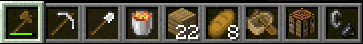

# Noverworld

## About

When you create a new world, you will spawn in the nether at a portal.
Your inventory contains a set of standard nether entry items you would have in a usual RSG situation.
Beat the dragon and reach the credits as usual.

The hotbar is customizable (read the FAQ section), and you can adjust it to reflect whatever post overworld split situation you'd like, 
but you shouldn't do so if you intend on running Noverworld the (yet to be created) speedrunning category (on https://www.speedrun.com/mc_dmce)
as that will make runs illegitimate.

You will spawn in the nether inside a portal with a random yaw (facing angle) and y height. _(These values are
deterministic based on your world seed, meaning creating a world with the same seed will yield the same yaw and targeted
y height. Therefore the mod is suitable for SSG)_

Depending on the version you are using the f3 menu will be automatically opened for you.

Before you join a new world the mod saves your render distance and FOV and resets to this after you leave the world.
_ie. this means you can configure the RD and FOV you will always spawn with by changing it in the main menu, and you
don't have to reset these settings to your preferred defaults in between runs._

The y height of the portal the mod attempts to target is determined using the following distribution:
- 80% chance of between 7-13
- 5% chance of between 14-59
- 10% chance of between 60-75
- 5% chance of between 76-90

The distribution was chosen in a fairly arbitrary manner. Make an issue if you want it changed.

## Support

If you have a problem with the mod, a question or experience a crash follow these steps:
1. Check the README to see if there's any relevant info on there, particularly the FAQ section.
2. Check the GitHub Issues (including closed issues).
3. Check the GitHub Releases to see if a newer build has been released that addresses your problem.
4. If you're experiencing a crash, make a GitHub issue and include the crash report.
5. If none of the above steps are helpful, DM me on discord (I'm in HBG Hub, Javacord etc. under this name).

## FAQ

- How do I change the hotbar?
  - Using the vanilla creative saved hotbars system. Refer to [this guide](https://www.planetminecraft.com/blog/saved-toolbars-how-to-use-your-extra-inventory-tutorial-guide/) if you need help.
- How do I reset my hotbar to the default included in the mod?
  - Empty your 9th hotbar (by removing all the items and saving it again with `c + 9`)
  - The mod will overwrite that hotbar when you create a new world.
- How do I set my FOV and render distance default?
  - Edit those values in the game's main menu (ie. outside of a world) and they'll be saved.
- I have a suggestion for improvement.
  - Make a GitHub issue and include as much information as you can.
- The mod is crashing while launching with `java.lang.reflect.InvocationTargetException`
  - Make sure you are running the release version of the mod ie. `noverworld-x.x.x.jar` instead of `noverworld-x-x-x-dev.jar`
- Is this incompatible with any mods:
  - This mod has been tested and confirmed to work with:
    - Sodium
    - Lithium
    - Starlight
    - FastReset (doesn't save world)
    - AutoReset (automatically reset worlds w/o macro)
    - LazyDFU
    - Moonlight (threaded stronghold gen)
    - Chunk mod (puts you in the world before spawn chunks have finished generating)
  - I will not support multi-threaded world gen such as C2ME. Perhaps sometime in the future as a separate branch.

Contributions are welcome. This mod is licensed under the GPL-3.0, meaning any forks/derivative works must also be open
source and licensed under the GPL-3.0. If you fork the mod and publish the distribution (without the intention of
merging your changes upstream) please change the name from Noverworld to a suitably distinct alternative to avoid confusion.
